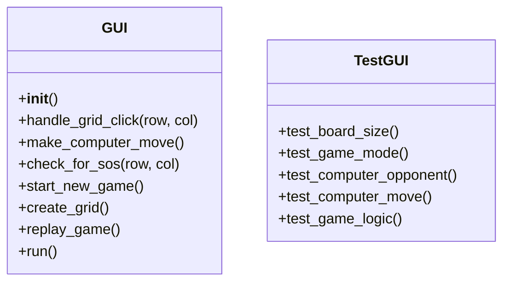

Jordan Taranto
CS449
Sprint-4
https://github.com/Jordinaa/cs449/tree/main/sprint3

# 1. Demonstration (8 points) 
Submit a video of no more than five minutes, clearly demonstrating that you have implemented the computer opponent features and written some automated unit tests.
1. A complete simple game where the blue player is a human, the red player is the computer, and there is a winner  
2. A complete general game where the blue player is the computer, the red player is a human, and there is a winner
3. A complete simple game where both sides are played by the computer A complete general game where both sides are played by the computer 
4. Some automated unit tests for the computer opponent.
In the video, you must explain what is being demonstrated.

# 2. User Stories for the Computer Opponent Requirements (1 points)
User Story Template: As a **role**, I want **goal** so that **benefit**

| ID | User Story Name             | User Story Description                                                                             | Priority | Estimated effort (hours) |
|----|-----------------------------|----------------------------------------------------------------------------------------------------|----------|-------------------------|
| 1  | Choose board size           | As a player, I want to choose the board size so that I can play on a board of my preferred size.    | High     | 1                       |
| 2  | Choose game mode            | As a player, I want to choose the game mode (simple or general) so that I can play the desired variant of the game. | High     | 1                       |
| 3  | Play against computer       | As a player, I want to play against a computer opponent so that I can enjoy the game even without another human player. | High     | 4                       |
| 4  | Computer makes valid moves  | As a player, I want the computer opponent to make valid moves according to the game rules so that the game is fair and challenging. | High     | 3                       |
| 5  | Computer follows game logic | As a player, I want the computer opponent to follow the game logic for simple and general games so that the gameplay is consistent. | High     | 3                       |

# 3. Acceptance Criteria (AC) for the Computer Opponent Requirements (4 points)
| User Story ID and Name          | AC ID | Description of Acceptance Criterion                                                      | Status    |
|---------------------------------|-------|--------------------------------------------------------------------------------------------|-----------|
| 1 - Choose board size           | 1.1   | The player can select the board size from a predefined set of options (e.g., 3x3, 5x5, 7x7). | Completed |
| 2 - Choose game mode            | 2.1   | The player can choose between simple and general game modes.                               | Completed |
| 3 - Play against computer       | 3.1   | The player can select the computer as the opponent for either the blue or red player.      | Completed |
|                                 | 3.2   | The game starts with the selected player (human or computer) making the first move.        | Completed |
| 4 - Computer makes valid moves  | 4.1   | The computer opponent selects an empty cell on the board for each move.                    | Completed |
|                                 | 4.2   | The computer opponent alternates between placing 'S' and 'O' letters on the board.         | Completed |
| 5 - Computer follows game logic | 5.1   | In simple game mode, the computer opponent aims to create an SOS pattern and win the game. | Completed |
|                                 | 5.2   | In general game mode, the computer opponent tries to maximize its score by creating SOS patterns. | Completed |
|                                 | 5.3   | The game ends when the board is full or an SOS pattern is created (in simple game mode).   | Completed |

# 4. Summary of All Source Code (1 points)
https://github.com/Jordinaa/cs449/tree/main/sprint4

| Source code file name | Production or Test Code? | # Lines of Code |
| --------------------- | ------------------------ | --------------- |
| GUI.py                | Production               | 195             |
| test_GUI.py           | Test                     | 91              |
| main.py               | Production               | 9               |
| Total                 |                          | 295             |
# 5. Production Code vs New User stories/Acceptance Criteria (2 points)
| User Story ID and Name          | AC ID | Class Name(s) | Method Name(s)                                  | Status   | Notes                                                                    |
| ------------------------------- | ----- | ------------- | ----------------------------------------------- | -------- | ------------------------------------------------------------------------ |
| 1 - Choose board size           | 1.1   | GUI           | __init__, create_grid                           | Complete | Board size selection implemented in constructor and grid creation method |
| 2 - Choose game mode            | 2.1   | GUI           | __init__                                        | Complete | Game mode selection implemented in constructor                           |
| 3 - Play against computer       | 3.1   | GUI           | __init__, handle_grid_click, make_computer_move | Complete | Computer opponent selection and gameplay implemented in multiple methods |
|                                 | 3.2   | GUI           | start_new_game, make_computer_move              | Complete | Game starts with the selected player's move                              |
| 4 - Computer makes valid moves  | 4.1   | GUI           | make_computer_move                              | Complete | Computer selects an empty cell for each move                             |
|                                 | 4.2   | GUI           | make_computer_move                              | Complete | Computer alternates between 'S' and 'O' letters                          |
| 5 - Computer follows game logic | 5.1   | GUI           | make_computer_move, check_for_sos               | Complete | Computer aims to create SOS pattern in simple game mode                  |
|                                 | 5.2   | GUI           | make_computer_move, check_for_sos               | Complete | Computer tries to maximize score in general game mode                    |
|                                 | 5.3   | GUI           | handle_grid_click, make_computer_move           | Complete | Game ends when board is full or SOS pattern is created                   |

# 6. Tests vs New User stories/Acceptance Criteria (2 points)
#### 6.1 Automated tests directly corresponding to some acceptance criteria

| User Story ID and Name          | AC ID | Class Name(s) | Method Name(s)                                  | Status   | Notes                                                                                       |
|---------------------------------|-------|---------------|-------------------------------------------------|----------|---------------------------------------------------------------------------------------------|
| 1 - Choose board size           | 1.1   | GUI           | __init__, create_grid                           | Complete | Board size selection implemented in constructor and grid creation method                    |
| 2 - Choose game mode            | 2.1   | GUI           | __init__                                        | Complete | Game mode selection implemented in constructor                                              |
| 3 - Play against computer       | 3.1   | GUI           | __init__, handle_grid_click, make_computer_move | Complete | Computer opponent selection and gameplay implemented in multiple methods                    |
|                                 | 3.2   | GUI           | start_new_game, make_computer_move              | Complete | Game starts with the selected player's move                                                 |
| 4 - Computer makes valid moves  | 4.1   | GUI           | make_computer_move                              | Complete | Computer selects an empty cell for each move                                                |
|                                 | 4.2   | GUI           | make_computer_move                              | Complete | Computer alternates between 'S' and 'O' letters                                             |
| 5 - Computer follows game logic | 5.1   | GUI           | make_computer_move, check_for_sos               | Complete | Computer aims to create SOS pattern in simple game mode                                     |
|                                 | 5.2   | GUI           | make_computer_move, check_for_sos               | Complete | Computer tries to maximize score in general game mode                                        |
|                                 | 5.3   | GUI           | handle_grid_click, make_computer_move           | Complete | Game ends when board is full or SOS pattern is created                                      |

#### 6.2 Manual tests directly corresponding to some acceptance criteria
- **Video - for manual test**
#### 6.3 Other automated or manual tests not corresponding to the acceptance criteria

| Number | Test Input | Expected Result | Class Name of the Test Code | Method Name of the Test Code |
| ------ | ---------- | --------------- | --------------------------- | ---------------------------- |

# 7. Present the class diagram of your production code (3 points) and describe how the class hierarchy in your design deals with the computer opponent requirements (3 points)?

- `GUI` class:
    - Represents the main class responsible for handling the graphical user interface and game logic.
    - methods for initializing game, handling user interactions, making computer moves, checking for SOS patterns, starting new game, creating grid, replaying the game, and running the game loop.
- `TestGUI` class:
    - Represents the test class responsible for automated testing of the `GUI` class.
    - Contains test methods for verifying the correctness of functionality such as board size selection, game mode selection, computer opponent behavior, computer moves, and game logic.

The class diagram shows the two main classes, `GUI` and `TestGUI`, and their respective methods. The `GUI` class encapsulates the game logic and user interface, while the `TestGUI` class focuses on testing the functionality of the `GUI` class.